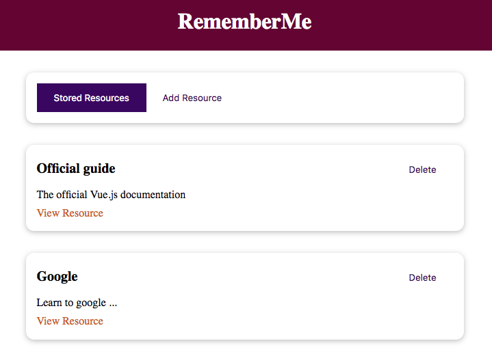
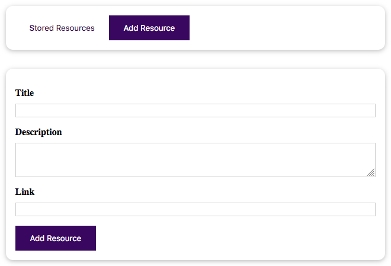
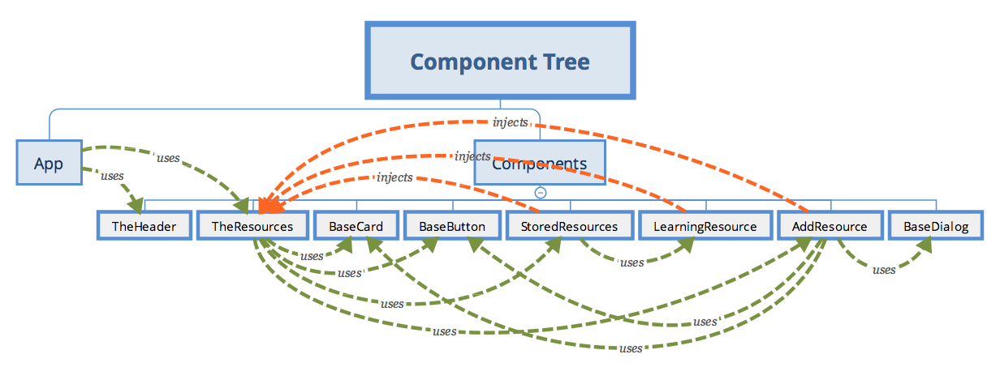

# Vue Learning Resources
This project is based on [Maximilian Schwarzmüller's Udemy Vue course](https://www.udemy.com/course/vuejs-2-the-complete-guide/).

## Project Overview

This project simulates a learning resources app. One can create, read and delete learning resources. Each learning resource has a title, description and URL. 

This single page app shows interesting Vue features, such as slots, teleport, component, and provide/inject.

### Main Page/Stored Resources



This page lists available learning resources. The _app title_ is at the top. Just below the _app title_ is the _menu bar_, which enables listing existing resources (_Stored Resources_) and creating a new resource (_Add Resource_). Next, comes the resource list. The Figure above shows two existing resources: Official guide ad Google.

One can visit a resource by clicking on _View Resource_ link, or delete a resource by clicking on the _Delete_ button.

The `App.vue` defines the main page. This page consists of two components: `TheHeader` and `TheResources`. 

### Add Resource



This page enables creating a new learning resource that consists of a title, description and link. The _Add Resource_ button saves the new resource and returns to the _Stored Resources_ page.

The `TheResource` component imports both the `StoredResources` and `AddResource` components.

## Components Overview



The `App.vue` imports  `TheHeader` and `TheResources` components. These components are responsible for integrating the following components:

- `TheHeader` component sets the main title. It uses the `title` props to set the title text. There is no behaviour in this component.

- `TheResources` component has several responsibilities. First, it uses `StoredResources` and `AddResource` to set the two main app features. Next, it stores the resource data by using an `array` as well as the `addResource` and `removeResource` methods. The array of resources along with the two methods are _provided_ to child components by a `provide` Vue method. Finally, this component uses the `component` tag to set the feature to show: _add resource_ or _stored resources_. The feature selection is triggered by a `click` event that uses a simple `string` to set which component to load.

- `StoredResources` component creates a list of `LearningResource`, representing stored learning resources. This component _injects_ the learning resource array by using the `inject` Vue property. 

- `LearningResource` component shows a learning resource properties. These properties are received by `props`, set by the `StoredResources` component. The `LearningResource` component also _injects_ (`inject`) the `removeResource` method set in the `TheResources` component - two parents up in the hierarchy.

- `AddResource` component sets a form to receive input data, representing a new learning resource. It _injects_ (`inject`) the `addResource` method, set in the `TheResources` component. The form data are set using `refs` instead of `v-model`. This is the base of Vue 3 composables. The component also validates the input.

- `BaseCard` component sets the rectangular rounded-border container for nearly all elements used in the app. It has one single `slot` that enables anything to be added inside the structure. It has some CSS, responsible for the aesthics. This component has no behaviour.

- `BaseButton` component sets the standard button used throughtout the app. As the `BaseCard` component, it has a single `slot` and some CSS, but no behaviour. __It is interesting to note though__ that this component may act as a normal button by using _behaviour passthrough_. This is possible because the `slot` tag is inside a `button` tag. Therefore, any behaviour set for `BaseButton` will be automatically delivered to the `button` element.

- `BaseDialog` component represents a dialog message box. It has three _named_ `slots` for _header_, _body_ and _actions_. The header `slot` may set the title via `props` if the `slot` is empty. The body `slot` is the default `slot`. The actions `slot` has a standard close button. The entire component is wrapped in a `teleport` tag that renders the component by the end of the `body` tag.

PS: `main.js` globally imports `BaseCard`, `BaseButton` and `BaseDialog`, as these components are used by several one components. 

## Project setup

```
yarn install
```
```
yarn serve
```